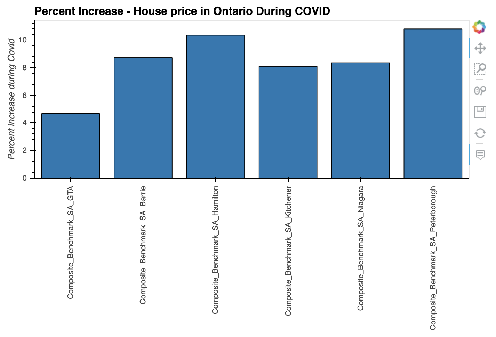

# Ontario Real Estate Analysis Post-Pandemic

Project Goal: to analyze the state of the Ontario Real Estate market, particularly around the GTA, and determine what if any impact COVID has had.

# Project Summary

Much has been written in the last several months about the impact of COVID on the future of real estate in large cities. A common notion was that COVID has made people rethink living in large cities like Toronto and is leading to an exodus to the suburbs or more rural areas. In this project we hope to determine to what extent this phenomenon has taken place. More generally, we will explore the relationship between the real estate markets of the GTA and several surrounding smaller cities.

# General Market Trends

Shown below are the average house prices and Housing Price Index (HPI) for GTA and other key cities of Ontario from 2005-2020. As is common knowledge, the GTA tops the list in terms of average house price and the trend is visible across the time period. Also, there has been a steady growth rise in home prices over the years across all cities with a steep spike in 2017 when home prices rose exponentially only to drop back down towards the beginning of 2018. HPI also follows a similar trend but the difference in distribution can be observed in the Violin plot which is shown.


# Recent Market Trends

Considering the data from 2019-2020 we observe that the percentage growth for home prices and the HPI for GTA during that period while positive is lower than that of other cities.


# COVID-19 Trends

We are considering the COVID time frame from Jan 2020 - Sep 2020 for ease of convenience and analysis.
we have data which shows that while the volume of house sales dropped during COVID, the prices did not see a drop but were stable and marginally increasing across all home segments. The same trend was observed across all cities and we are have shown below the graphical represenation of GTA for reference.
One key point to note though is that the percent increase in house prices was lowest in the GTA and highest in Peterborough during the same period. This is in line with our theory that there is shift in purchase preferences of many home buyers who are now preferring to venture outside of GTA thus increasing the price of properties in other cities.





# Linear Regression Model

We used a linear regression model to further explore the relationship between GTA house prices and the house prices in surrounding markets. We used the prior months composite average house price in several Ontario cities to predict the current month's price in the GTA market.

## Features

Below are the features we used to predict the current month's composite house price in the GTA.


## Building the Model

First, we split the data into training and testing datasets, in a 70%-30% ratio. Given this is time series we were sure to split the data chronologically. Next we scaled the data using a MinMaxScaler, as shown below:

```
from sklearn.preprocessing import StandardScaler
from sklearn.preprocessing import MinMaxScaler
scaler = MinMaxScaler()
X_scaler = scaler.fit(X_train)

X_train_scaled = X_scaler.transform(X_train)
X_test_scaled = X_scaler.transform(X_test)
```

Finally, we built the Linear Regression model using the SciKit Learn library.

## Results

The Linear Regression model clearly showed there has historically been a close relationship between the GTA housing market and the markets of the surrounding regions. As our features were able to fairly accurately predict the next month's price in the GTA.


Coefficient of Determination or R-squared was 82% for the model. R-squared provides a measure of how well observed outcomes are replicated by the model, based on the proportion of total variation of outcomes explained by the model. An R-squared of 1 or 100% would be a perfect prediction. An R-squared of 0.82 is fairly high, indicating there is a predictive relationship between our x-variable and our y-variable.

Below is a snapshot of our results:


# LSTM Model

While simulating the LSTM Model, we ran the danger of overfitting the model using the available features hence we have not included the same in our analysis. The working file is however available as part of the submission.

# What we could have done differently


# Data Sources

