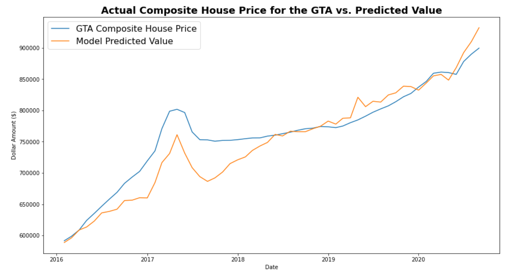

# Ontario Real Estate Analysis Post-Pandemic

Project Goal: to analyze the state of the Ontario Real Estate market, particularly around the GTA, and determine what if any impact COVID has had.

# Project Summary

Much has been written in the last several months about the impact of COVID on the future of real estate in large cities. A common notion was that COVID has made people rethink living in large cities like Toronto and is leading to an exodus to the suburbs or more rural areas. In this project we hope to determine to what extent this phenomenon has taken place. More generally, we will explore the relationship between the real estate markets of the GTA and several surrounding smaller cities.


# Linear Regression Model

We used a linear regression model to further explore the relationship between GTA house prices and the house prices in surrounding markets. We used the prior months composite average house price in several Ontario cities to predict the current month's price in the GTA market.

## Features

Below are the features we used to predict the current month's composite house price in the GTA.


## Building the Model

First, we split the data into training and testing datasets, in a 70%-30% ratio. Given this is time series we were sure to split the data chronologically. Next we scaled the data using a MinMaxScaler, as shown below:

```
from sklearn.preprocessing import StandardScaler
from sklearn.preprocessing import MinMaxScaler
scaler = MinMaxScaler()
X_scaler = scaler.fit(X_train)

X_train_scaled = X_scaler.transform(X_train)
X_test_scaled = X_scaler.transform(X_test)
```

Finally, we built the Linear Regression model using the SciKit Learn library.

## Results

The Linear Regression model clearly showed there has historically been a close relationship between the GTA housing market and the markets of the surrounding regions.



Coefficient of Determination or R-squared was 82% for the model. R-squared provides a measure of how well observed outcomes are replicated by the model, based on the proportion of total variation of outcomes explained by the model. An R-squared of 1 or 100% would be a perfect prediction. An R-squared of 0.82 is fairly high, indicating there is a predictive relationship between our x-variable and our y-variable.

Below is a snapshot of our results:


